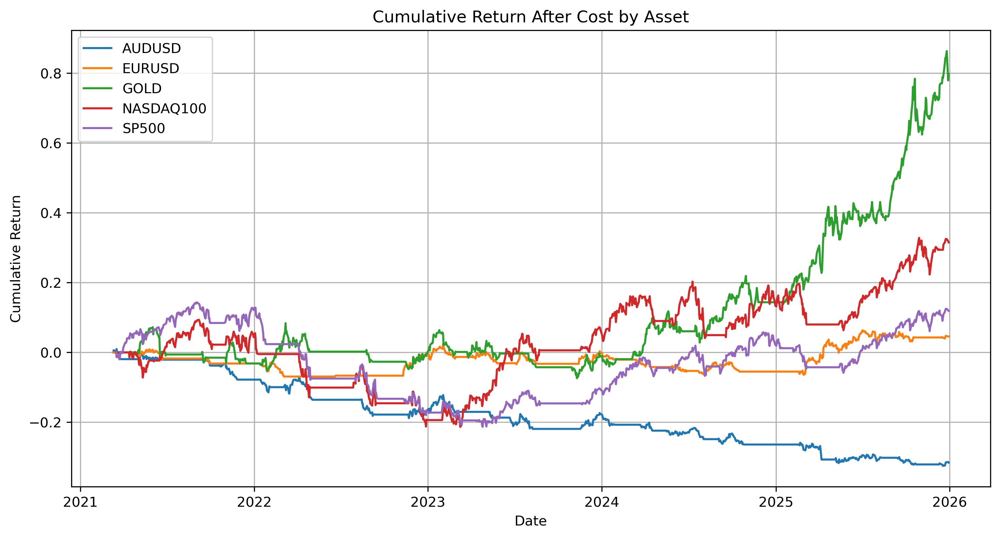

# FX & CFD Trading Performance Analytics

## Project Overview

I built this project to analyse how a simple trading strategy performs across several FX, commodity, and equity index markets after taking trading costs into account.

The project uses Python to download and prepare historical price data, generate moving-average trading signals, and calculate strategy returns before and after estimated spread, transaction cost, and slippage. I also used DuckDB SQL for performance and cost analysis, and built a Tableau dashboard to make the results easier to compare across assets.

This is not intended to be a live trading system. The main goal is to show how trading performance can change once execution costs are included, and how Python, SQL, and Tableau can be used together in a repeatable trading analytics workflow.

**Dashboard:** [View Interactive Tableau Dashboard](https://public.tableau.com/views/FX_CFD_Trading_Performance_Dashboard/FXCFDTradingPerformanceDashboard?:language=en-US&:sid=&:redirect=auth&:display_count=n&:origin=viz_share_link)


---

## Business and Trading Objective

A trading strategy can look profitable on paper, but the result may change once spread, slippage, and transaction costs are included. This project focuses on the after-cost performance of a simple moving-average strategy across different asset classes.

The main questions I wanted to answer were:

- Which assets performed best after trading costs?
- How much did spread, transaction cost, and slippage reduce returns?
- Which assets had larger drawdowns or higher execution costs?
- Did higher volatility lead to higher slippage?
- How can the results be monitored using Python, SQL, and Tableau?

I designed the project as a small trading analytics case study, similar to the type of work a trading analyst or quant analyst might do when reviewing strategy performance and execution quality.

---

## Data Source and Assets Covered

Historical daily OHLCV data is downloaded using `yfinance`.

| Asset | Ticker Used | Asset Class |
|---|---:|---|
| EUR/USD | `EURUSD=X` | FX |
| AUD/USD | `AUDUSD=X` | FX |
| Gold Futures | `GC=F` | Commodity |
| NASDAQ 100 | `^NDX` | Equity Index |
| S&P 500 | `^GSPC` | Equity Index |

The dataset includes daily open, high, low, close, volume, returns, rolling volatility, moving averages, trading signals, strategy returns, costs, and drawdown metrics.

---

## Methodology

The project follows the main steps of a trading analytics workflow:

1. **Collect market data**  
   Download daily OHLCV data for FX pairs, gold, and equity indices.

2. **Prepare the dataset**  
   Clean the raw data and calculate daily returns, log returns, rolling volatility, and moving averages.

3. **Generate trading signals**  
   Use a simple moving-average crossover rule to decide when the strategy should be invested.

4. **Run the backtest**  
   Apply a one-day lag to the signal to avoid look-ahead bias, then calculate strategy returns before costs.

5. **Add trading costs**  
   Estimate spread cost, transaction cost, and slippage cost, then deduct them from strategy returns.

6. **Evaluate performance**  
   Compare assets using cumulative return, annualised return, volatility, Sharpe ratio, maximum drawdown, win rate, exposure, turnover, and total cost.

7. **Analyse results with SQL**  
   Use DuckDB SQL to summarise performance, cost impact, annual returns, and high-volatility periods.

8. **Build a dashboard**  
   Create a Tableau dashboard to compare return, drawdown, Sharpe ratio, execution cost, slippage, and volatility across assets.

---

## Trading Strategy Logic

The strategy uses a simple moving-average trend-following rule:

- If the 20-day moving average is above the 50-day moving average, the strategy enters a long position.
- If the 20-day moving average is below or equal to the 50-day moving average, the strategy stays out of the market.

To avoid look-ahead bias, the trading position is shifted by one day. This means today's return is based on yesterday's signal rather than information from the same day.

```python
signal = 1 if ma_20 > ma_50 else 0
position = signal.shift(1)
strategy_return = position * daily_return
```

This makes the backtest more realistic because the model only trades on information that would have been available at the time.

---

## Transaction Cost and Slippage Simulation

The project simulates three types of trading frictions:

| Cost Type | Meaning |
|---|---|
| Spread Cost | The bid-ask spread paid when entering or exiting a position |
| Transaction Cost | A fixed trading cost applied when turnover occurs |
| Slippage Cost | Additional execution cost that increases under higher volatility |
| Total Cost | Combined cost deducted from before-cost strategy returns |

After-cost return is calculated as:

```text
strategy_return_after_cost = strategy_return_before_cost - total_cost
```

This step is important because trading costs can materially reduce profitability, especially for strategies with frequent turnover or assets with high volatility.

---

## Performance Metrics

The project evaluates each asset using the following metrics:

| Metric | Description |
|---|---|
| Cumulative Return After Cost | Total strategy return after deducting transaction costs and slippage |
| Annualised Return | Return scaled to a yearly basis |
| Annualised Volatility | Risk level of the strategy return |
| Sharpe Ratio | Risk-adjusted return |
| Maximum Drawdown | Largest peak-to-trough loss |
| Win Rate | Percentage of profitable trading days |
| Exposure | Percentage of time the strategy is invested |
| Turnover | Number of position changes |
| Total Execution Cost | Total cost from spread, transaction cost, and slippage |

---

## SQL-Based Analysis

DuckDB is used to run SQL analysis on the processed trading performance data. The SQL scripts are stored in the `sql/` folder.

| SQL File | Purpose |
|---|---|
| `create_tables.sql` | Loads CSV outputs into DuckDB tables |
| `analysis_queries.sql` | Runs performance, cost, annual return, and volatility analysis |

The SQL analysis answers four main questions:

1. Which asset delivered the strongest after-cost risk-adjusted performance?
2. Which asset had the highest total execution cost?
3. How did annual performance change across assets over time?
4. How did high-volatility conditions affect slippage and trading cost?

Example SQL query:

```sql
SELECT
    asset,
    ROUND(cumulative_return_after_cost, 4) AS cumulative_return_after_cost,
    ROUND(annualised_return_after_cost, 4) AS annualised_return_after_cost,
    ROUND(sharpe_ratio_after_cost, 4) AS sharpe_ratio_after_cost,
    ROUND(max_drawdown_after_cost, 4) AS max_drawdown_after_cost
FROM performance_summary
ORDER BY sharpe_ratio_after_cost DESC;
```

---

## Tableau Dashboard

The Tableau dashboard provides a visual summary of the strategy performance and execution cost analysis.

Dashboard components include:

- Cumulative return after cost by asset
- Drawdown after cost by asset
- Sharpe ratio after cost by asset
- Total execution cost by asset
- Average slippage versus 20-day volatility



The dashboard helps compare performance across assets and identify whether returns are driven by strong price trends, high volatility, or execution cost differences.

---

## Key Findings

1. **Gold was the strongest performer after costs.**  
   Gold reached an after-cost cumulative return of around **79.7%** and had the highest Sharpe ratio, about **0.98**. This suggests the moving-average rule worked better in a market with stronger trending behaviour.

2. **NASDAQ 100 also performed well, but costs were higher.**  
   NASDAQ 100 had an after-cost cumulative return of around **31.5%**, but it also had the highest total execution cost, about **0.0424**. This shows why it is important to check both return and cost, not just the final profit number.

3. **AUD/USD did not work well with this strategy.**  
   AUD/USD ended with an after-cost cumulative return of around **-31.6%** and a Sharpe ratio of about **-1.08**. In this period, the moving-average rule did not capture useful trends for this pair.

4. **Trading costs mattered across all assets.**  
   After-cost returns were lower than before-cost returns for every asset. This is a useful reminder that backtests can look too optimistic if execution costs are ignored.

5. **Higher volatility was generally associated with higher slippage.**  
   The slippage analysis showed that more volatile assets tended to have higher average slippage costs, which matches the idea that execution becomes harder in unstable market conditions.

---

## Project Structure

```text
FX_CFD_Trading_Analytics/
├── README.md
├── requirements.txt
├── data/
│   ├── raw_market_data.csv
│   ├── processed_market_data.csv
│   ├── trading_signals.csv
│   ├── trade_performance.csv
│   ├── performance_summary.csv
│   └── dashboard_data.csv
├── notebooks/
│   └── end_to_end_trading_analytics.ipynb
├── sql/
│   ├── create_tables.sql
│   └── analysis_queries.sql
├── dashboard/
│   ├── FX_CFD_Trading_Performance_Dashboard.png
│   ├── cumulative_return_after_cost.png
│   └── FX_CFD_Trading_Performance_Dashboard.twbx
└── reports/
    └── FX_CFD_Trading_Analytics_Report.pdf
```

---

## How to Run

### 1. Clone the repository

```bash
git clone <your-repository-url>
cd FX_CFD_Trading_Analytics
```

### 2. Install dependencies

```bash
pip install -r requirements.txt
```

### 3. Run the notebook

Open and run the notebook:

```text
notebooks/end_to_end_trading_analytics.ipynb
```

The notebook will generate cleaned data, trading signals, performance outputs, and dashboard-ready CSV files.

### 4. Run SQL scripts with DuckDB

From the project root:

```bash
duckdb notebooks/trading_analytics.duckdb < sql/create_tables.sql
duckdb notebooks/trading_analytics.duckdb < sql/analysis_queries.sql
```

### 5. Open the Tableau dashboard

Open the Tableau packaged workbook:

```text
dashboard/FX_CFD_Trading_Performance_Dashboard.twbx
```

---

## Limitations

This project is designed for analytics and portfolio demonstration purposes. It has several limitations:

- The strategy is a simple long-only moving-average strategy and does not include short selling.
- Spread, slippage, and transaction costs are simulated rather than sourced from real broker execution records.
- The backtest does not include leverage, margin requirements, overnight financing, tax, or funding costs.
- The strategy parameters are fixed and are not optimised through walk-forward testing.
- Daily data is used, so the project does not capture intraday execution dynamics.

---

## Future Improvements

Potential extensions include:

- Add short-selling logic and compare long-only versus long-short performance.
- Test multiple moving-average windows such as 10/50, 20/100, and 50/200.
- Add benchmark comparison against buy-and-hold returns.
- Add volatility targeting or stop-loss rules for risk management.
- Use real spread and tick-level data to model execution quality more accurately.
- Build an automated reporting pipeline using Python, DuckDB, and Tableau extracts.

---

## Skills Demonstrated

- Financial time-series analysis
- Trading signal generation
- Backtesting and performance evaluation
- Transaction cost and slippage simulation
- SQL-based trading analytics with DuckDB
- Tableau dashboard design
- Python data processing with Pandas and NumPy

---

## Disclaimer

This project is for educational and portfolio demonstration purposes only. It is not financial advice and should not be used as a production trading system.
