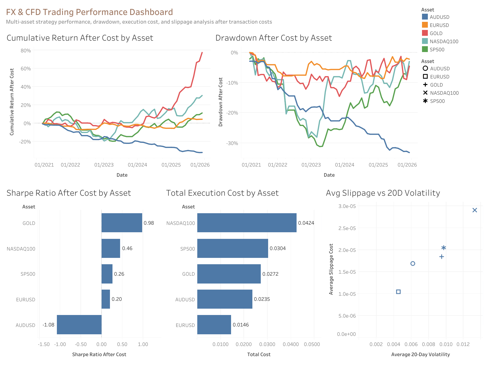
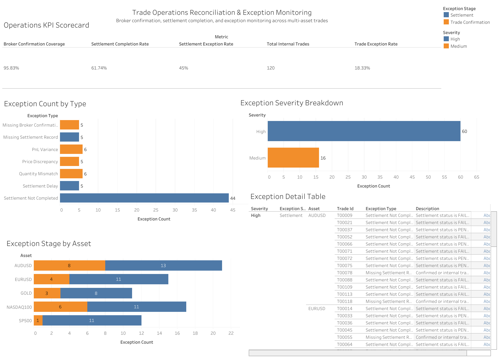

# FX & CFD Trading Operations Analytics

A portfolio project that uses **Python, SQL, and Tableau** to analyse multi-asset trading performance, validate data quality, and simulate trade operations reconciliation across FX, commodity, and equity index instruments.

The project is designed to show how raw market and trade lifecycle data can be transformed into a controlled analytics workflow: from **strategy performance analysis** and **transaction cost modelling** to **data governance**, **broker confirmation checks**, **settlement monitoring**, and **business-facing dashboards**.

---

## Project Links

- **Full Project Report:** [report/report.md](report/report.md)
- **Dashboard 1 — FX & CFD Trading Performance:** [View on Tableau Public](https://public.tableau.com/views/Dashboard1FXCFDTradingPerformanceDashboard/FXCFDTradingPerformanceDashboard?:language=zh-CN&:sid=&:redirect=auth&:display_count=n&:origin=viz_share_link)
- **Dashboard 2 — Trade Operations Monitoring:** [View on Tableau Public](https://public.tableau.com/views/Dashboard2TradeOperationsReconciliationExceptionMonitoring_17799001041320/TradeOperationsMonitoring?:language=zh-CN&:sid=&:redirect=auth&:display_count=n&:origin=viz_share_link)

---

## Executive Summary

This project covers five instruments: **AUD/USD, EUR/USD, Gold, NASDAQ 100, and S&P 500**. It evaluates whether a simple moving-average trend-following strategy remains profitable after transaction costs and slippage, and then extends the analysis into data quality checks and trade operations exception monitoring.

The analysis found that strategy performance varied significantly across assets. **Gold was the strongest performer**, with an after-cost cumulative return of approximately **79.7%** and a Sharpe ratio of **0.98**. **NASDAQ 100** also generated a positive after-cost return of approximately **31.5%**, but with higher execution cost. **AUD/USD was the weakest asset**, with an after-cost cumulative return of approximately **-31.6%** and a Sharpe ratio of **-1.08**.

The trade operations module simulated **120 internal trades**, **115 broker confirmations**, and **115 settlement records**. Broker confirmation coverage reached **95.83%**, while settlement completion was **61.74%**. The largest operational issue was **Settlement Not Completed**, with **44 cases**, indicating that settlement monitoring is the main follow-up priority in the simulated trade lifecycle.

---

## Business Questions

This project answers four practical questions for a trading, risk, or operations team:

1. Which assets delivered the strongest after-cost strategy performance?
2. How much did execution cost and slippage reduce profitability?
3. Are the trading calculations reliable enough for reporting and review?
4. What operational exceptions appear when internal trades are reconciled against broker confirmations and settlement records?

The goal is not only to run a backtest, but also to show how trading data can be turned into a **controlled, explainable, and stakeholder-ready analytics workflow**.

---

## Tools & Methods

| Area | Tools / Methods | Purpose |
|---|---|---|
| Programming | Python, Pandas, NumPy | Data collection, cleaning, signal generation, cost simulation, metrics calculation |
| SQL Analysis | DuckDB, SQL | Aggregated reporting tables and analysis-ready exports |
| Market Data | yfinance | Historical OHLCV data extraction |
| Trading Analytics | Returns, drawdown, Sharpe ratio, turnover, transaction cost, slippage | Strategy performance and risk evaluation |
| Data Governance | Schema checks, missing value checks, OHLC validation, reconciliation checks | Data reliability and auditability |
| Trade Operations | Broker confirmation checks, settlement checks, exception reports | Trade lifecycle monitoring and operational risk control |
| Visualisation | Tableau, Matplotlib | Interactive dashboards and project visuals |
| Version Control | Git, GitHub | Portfolio presentation and reproducible project structure |

---

## Project Workflow

The project is organised into three analysis modules.

### 1. Trading Performance Analytics

Notebook: [`notebooks/01_end_to_end_trading_analytics.ipynb`](notebooks/01_end_to_end_trading_analytics.ipynb)

This module builds the main trading analytics pipeline.

**What it does:**

- Collects and structures historical OHLCV data for five assets.
- Calculates returns, log returns, moving averages, rolling volatility, and trading signals.
- Applies a moving-average crossover strategy.
- Shifts signals by one trading day to avoid look-ahead bias.
- Simulates spread, slippage, and transaction costs.
- Calculates after-cost cumulative return, drawdown, Sharpe ratio, win rate, exposure, turnover, and asset-level performance.
- Exports dashboard-ready data for Tableau.

**Strategy rule:**

| Condition | Position |
|---|---|
| 20-day moving average > 50-day moving average | Long |
| 20-day moving average <= 50-day moving average | Flat |

---

### 2. Data Quality & Risk Assessment

Notebook: [`notebooks/02_data_quality_risk_assessment.ipynb`](notebooks/02_data_quality_risk_assessment.ipynb)

This module checks whether the data and calculations are reliable enough for reporting.

**What it does:**

- Validates dataset schema and required fields.
- Checks missing values, duplicate records, date gaps, and OHLC consistency.
- Reconciles return calculations and after-cost PnL logic.
- Reviews signal logic and transaction cost calculations.
- Produces data quality and governance outputs for review.

**Business value:**

This layer makes the project more realistic because trading analytics results should not be trusted unless the underlying data and calculations are complete, consistent, and auditable.

---

### 3. Trade Operations Reconciliation

Notebook: [`notebooks/03_trade_operations_reconciliation.ipynb`](notebooks/03_trade_operations_reconciliation.ipynb)

This module simulates a trade lifecycle control process.

**What it does:**

- Creates simulated internal trade records.
- Creates broker confirmation and settlement records.
- Compares internal records against broker confirmations.
- Flags missing broker confirmations, quantity mismatches, price discrepancies, and PnL variances.
- Checks settlement completion, missing settlement records, and settlement delays.
- Produces exception summaries and dashboard-ready monitoring tables.

**Key operational results:**

| Metric | Result |
|---|---:|
| Total internal trades | 120 |
| Broker confirmations | 115 |
| Settlement records | 115 |
| Broker confirmation coverage | 95.83% |
| Settlement completion rate | 61.74% |
| Trade exception rate | 18.33% |
| Settlement exception rate | 45.00% |
| Largest exception type | Settlement Not Completed, 44 cases |

**Business value:**

This module shows how a trading operations team could monitor unresolved confirmations, settlement breaks, and high-severity exceptions across multiple assets. It is especially relevant to trading operations, market operations, risk operations, and financial data analyst roles.

---

## Interactive Tableau Dashboards

### Dashboard 1: FX & CFD Trading Performance Dashboard

**Interactive Dashboard:** [View on Tableau Public](https://public.tableau.com/views/Dashboard1FXCFDTradingPerformanceDashboard/FXCFDTradingPerformanceDashboard?:language=zh-CN&:sid=&:redirect=auth&:display_count=n&:origin=viz_share_link)



This dashboard presents after-cost trading performance across assets. It includes cumulative return, drawdown, Sharpe ratio, total execution cost, and the relationship between slippage and 20-day volatility.

**Key insights:**

- Gold delivered the strongest strategy performance, with the highest after-cost cumulative return and Sharpe ratio.
- NASDAQ 100 generated positive returns but also had the highest total execution cost.
- AUD/USD showed weak after-cost performance and a negative Sharpe ratio.
- Higher volatility was associated with higher average slippage, reinforcing the importance of execution cost monitoring.

---

### Dashboard 2: Trade Operations Reconciliation & Exception Monitoring

**Interactive Dashboard:** [View on Tableau Public](https://public.tableau.com/views/Dashboard2TradeOperationsReconciliationExceptionMonitoring_17799001041320/TradeOperationsMonitoring?:language=zh-CN&:sid=&:redirect=auth&:display_count=n&:origin=viz_share_link)



This dashboard focuses on trade lifecycle monitoring. It tracks broker confirmation coverage, settlement completion, exception severity, exception type distribution, asset-level breaks, and trade-level exception details.

**Key insights:**

- Settlement-related issues were the main source of operational risk.
- `Settlement Not Completed` was the largest exception category, with 44 cases.
- High-severity exceptions accounted for 60 out of 76 total exceptions.
- AUD/USD, NASDAQ 100, and EUR/USD had the highest operational exception counts.
- The detail table supports trade-level follow-up by showing affected trade IDs, assets, exception types, severity, and descriptions.

---

## Repository Structure

```text
FX_CFD_Trading_Analytics/
├── README.md
├── requirements.txt
├── .gitignore
│
├── notebooks/
│   ├── 01_end_to_end_trading_analytics.ipynb
│   ├── 02_data_quality_risk_assessment.ipynb
│   └── 03_trade_operations_reconciliation.ipynb
│
├── data/
│   ├── raw/
│   ├── processed/
│   ├── dashboard/
│   ├── sql_exports/
│   └── trade_operations/
│
├── sql/
│   ├── create_tables.sql
│   ├── analysis_queries.sql
│   ├── trade_operations_reconciliation_queries.sql
│   └── trading_analytics.duckdb
│
├── dashboard/
│   ├── cumulative_return_after_cost.png
│   └── tableau/
│       ├── FX_CFD_Trading_Performance_Dashboard.png
│       ├── Trade_Operations_Monitoring.png
│       ├── Dashboard 1_ FX & CFD Trading Performance Dashboard.twbx
│       └── Dashboard 2_ Trade Operations Reconciliation & Exception Monitoring.twbx
│
├── data_quality_risk_outputs/
│   ├── data_quality_risk_scorecard.csv
│   ├── schema_validation.csv
│   ├── missing_value_summary.csv
│   ├── duplicate_key_summary.csv
│   ├── ohlc_integrity_summary.csv
│   ├── return_reconciliation_summary.csv
│   ├── cost_pnl_reconciliation_summary.csv
│   └── governance_recommendations.csv
│
├── trade_operations_outputs/
│   ├── internal_trades.csv
│   ├── broker_confirmations.csv
│   ├── settlement_records.csv
│   ├── trade_reconciliation_summary.csv
│   ├── settlement_exception_summary.csv
│   ├── trade_exception_report.csv
│   ├── settlement_exception_report.csv
│   ├── asset_exception_summary.csv
│   └── trade_operations_scorecard.csv
│
├── trade_operations_outputs_dashboard_ready/
│   ├── exception_summary_union.csv
│   ├── exception_detail_union.csv
│   ├── asset_exception_summary.csv
│   └── trade_operations_scorecard.csv
│
└── report/
    └── report.md
```

---

## Main Outputs

| Output Area | Example Files | Purpose |
|---|---|---|
| Trading performance | `dashboard_data.csv`, `performance_summary.csv`, `trade_performance.csv` | Asset-level performance and after-cost strategy review |
| SQL reporting | `sql_performance_summary.csv`, `sql_cost_impact.csv`, `sql_annual_performance.csv` | Aggregated reporting and business summaries |
| Data governance | `schema_validation.csv`, `missing_value_summary.csv`, `return_reconciliation_summary.csv`, `data_quality_risk_scorecard.csv` | Data reliability and calculation validation |
| Trade operations | `trade_exception_report.csv`, `settlement_exception_report.csv`, `trade_operations_scorecard.csv` | Broker confirmation, settlement, and exception monitoring |
| Tableau dashboards | `.twbx` files and dashboard screenshots | Stakeholder-facing visual analysis |
| Project report | `report/report.md` | Full methodology, quantitative results, and business interpretation |

---


## Why This Project Is Relevant

This project is relevant to **trading operations, financial data analytics, risk operations, market operations, and data analyst** roles because it combines technical analytics with business controls used in trading environments:

- after-cost trading performance analysis;
- execution cost and slippage modelling;
- SQL-based performance reporting;
- data quality and calculation governance;
- broker confirmation and settlement reconciliation;
- exception monitoring and severity classification;
- dashboard-ready reporting for stakeholders.

---

## Disclaimer

This project is for portfolio and educational purposes only. It is not financial advice and does not represent a live trading system.
