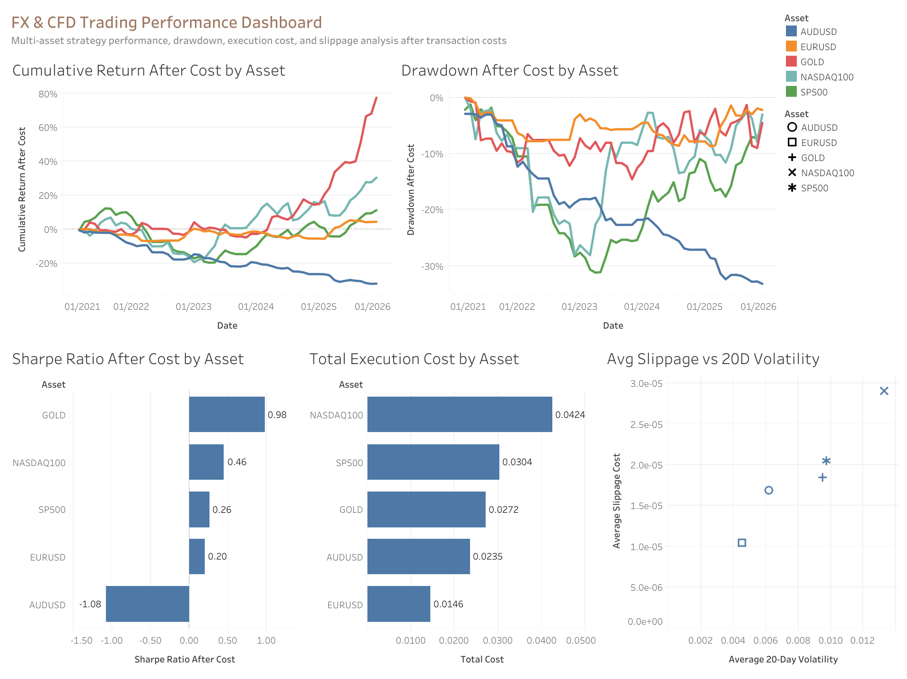

# FX & CFD Trading Performance Analytics

## Project Overview

This project builds an end-to-end trading performance analytics workflow for FX pairs, gold, and equity index CFDs. It uses Python to collect and clean historical market data, generate moving-average trading signals, simulate transaction costs and slippage, evaluate after-cost trading performance, run SQL-based analysis with DuckDB, and visualise the results in Tableau.

The purpose of this project is not to build a production trading system, but to demonstrate how a trading analyst can evaluate strategy performance after realistic execution frictions such as spread, slippage, and transaction costs.




## Business and Trading Objective

In real trading environments, a strategy that looks profitable before costs may become much less attractive after considering execution costs. This project answers the following questions:

- Which assets delivered the strongest after-cost performance?
- How much did transaction costs and slippage reduce strategy returns?
- Which assets had the highest drawdown and execution cost?
- How did volatility affect slippage and trading cost?
- How can Python, SQL, and Tableau be combined to build a repeatable trading performance monitoring workflow?

This project is designed from the perspective of a trading analyst or quant analyst supporting desk-level performance review, cost attribution, and strategy monitoring.


## Data Source and Assets Covered

Historical daily OHLCV data is downloaded using `yfinance`.

| Asset | Ticker Used | Asset Class |
|---|---:|---|
| EUR/USD | `EURUSD=X` | FX |
| AUD/USD | `AUDUSD=X` | FX |
| Gold Futures | `GC=F` | Commodity |
| NASDAQ 100 | `^NDX` | Equity Index |
| S&P 500 | `^GSPC` | Equity Index |

The dataset includes daily open, high, low, close, volume, returns, rolling volatility, moving averages, trading signals, strategy returns, costs, and drawdown metrics.

## Methodology

The project follows a full analytics workflow:

1. **Data Collection**  
   Download historical daily market data for FX pairs, gold, and equity indices.

2. **Data Cleaning and Feature Engineering**  
   Clean raw OHLCV data and calculate daily returns, log returns, 20-day rolling volatility, and moving averages.

3. **Trading Signal Generation**  
   Generate long-only trend-following signals using a moving-average crossover rule.

4. **Backtesting Logic**  
   Apply lagged trading positions to avoid look-ahead bias and calculate before-cost strategy returns.

5. **Transaction Cost and Slippage Simulation**  
   Estimate spread cost, transaction cost, slippage cost, and total execution cost.

6. **Performance Evaluation**  
   Calculate cumulative return, annualised return, annualised volatility, Sharpe ratio, maximum drawdown, win rate, exposure, turnover, and total cost.

7. **SQL-Based Analysis**  
   Use DuckDB SQL to analyse asset-level performance, annual returns, cost impact, and high-volatility trading behaviour.

8. **Dashboard Visualisation**  
   Build a Tableau dashboard to monitor cumulative return, drawdown, Sharpe ratio, execution cost, slippage, and volatility.

## Trading Strategy Logic

The strategy uses a simple moving-average trend-following rule:

- If the 20-day moving average is above the 50-day moving average, the strategy enters a long position.
- If the 20-day moving average is below or equal to the 50-day moving average, the strategy stays out of the market.

To avoid look-ahead bias, the trading position is shifted by one day. This means today's return is based on yesterday's signal rather than information from the same day.

```python
signal = 1 if ma_20 > ma_50 else 0
position = signal.shift(1)
strategy_return = position * daily_return
```

This makes the backtest more realistic because the model only trades on information that would have been available at the time.

## Transaction Cost and Slippage Simulation

The project simulates three types of trading frictions:

| Cost Type | Meaning |
|---|---|
| Spread Cost | The bid-ask spread paid when entering or exiting a position |
| Transaction Cost | A fixed trading cost applied when turnover occurs |
| Slippage Cost | Additional execution cost that increases under higher volatility |
| Total Cost | Combined cost deducted from before-cost strategy returns |

After-cost return is calculated as:

```text
strategy_return_after_cost = strategy_return_before_cost - total_cost
```

This step is important because trading costs can materially reduce profitability, especially for strategies with frequent turnover or assets with high volatility.

## Performance Metrics

The project evaluates each asset using the following metrics:

| Metric | Description |
|---|---|
| Cumulative Return After Cost | Total strategy return after deducting transaction costs and slippage |
| Annualised Return | Return scaled to a yearly basis |
| Annualised Volatility | Risk level of the strategy return |
| Sharpe Ratio | Risk-adjusted return |
| Maximum Drawdown | Largest peak-to-trough loss |
| Win Rate | Percentage of profitable trading days |
| Exposure | Percentage of time the strategy is invested |
| Turnover | Number of position changes |
| Total Execution Cost | Total cost from spread, transaction cost, and slippage |

## SQL-Based Analysis

DuckDB is used to run SQL analysis on the processed trading performance data. The SQL scripts are stored in the `sql/` folder.

| SQL File | Purpose |
|---|---|
| `create_tables.sql` | Loads CSV outputs into DuckDB tables |
| `analysis_queries.sql` | Runs performance, cost, annual return, and volatility analysis |

The SQL analysis answers four main questions:

1. Which asset delivered the strongest after-cost risk-adjusted performance?
2. Which asset had the highest total execution cost?
3. How did annual performance change across assets over time?
4. How did high-volatility conditions affect slippage and trading cost?

Example SQL query:

```sql
SELECT
    asset,
    ROUND(cumulative_return_after_cost, 4) AS cumulative_return_after_cost,
    ROUND(annualised_return_after_cost, 4) AS annualised_return_after_cost,
    ROUND(sharpe_ratio_after_cost, 4) AS sharpe_ratio_after_cost,
    ROUND(max_drawdown_after_cost, 4) AS max_drawdown_after_cost
FROM performance_summary
ORDER BY sharpe_ratio_after_cost DESC;
```

## Tableau Dashboard

The Tableau dashboard provides a visual summary of the strategy performance and execution cost analysis.

Dashboard components include:

- Cumulative return after cost by asset
- Drawdown after cost by asset
- Sharpe ratio after cost by asset
- Total execution cost by asset
- Average slippage versus 20-day volatility


The dashboard helps compare performance across assets and identify whether returns are driven by strong price trends, high volatility, or execution cost differences.

## Key Findings

1. **Gold produced the strongest after-cost performance.**  
   Gold achieved the highest cumulative return after cost at approximately **79.7%**, with the highest Sharpe ratio of around **0.98**. This suggests that the moving-average strategy worked better on assets with stronger trend-following behaviour.

2. **NASDAQ 100 generated positive returns but also had the highest execution cost.**  
   NASDAQ 100 achieved an after-cost cumulative return of approximately **31.5%**, but also had the highest total execution cost at around **0.0424**. This shows that high-return assets may still be meaningfully affected by slippage and trading costs.

3. **AUD/USD underperformed after costs.**  
   AUD/USD recorded an after-cost cumulative return of approximately **-31.6%** and a negative Sharpe ratio of around **-1.08**, indicating that the moving-average strategy was not effective for this asset over the tested period.

4. **Transaction costs reduced performance across all assets.**  
   Every asset showed lower after-cost returns compared with before-cost returns, highlighting the importance of including realistic execution assumptions in trading analytics.

5. **Volatility was linked to higher slippage cost.**  
   Assets with higher average 20-day volatility generally experienced higher slippage costs, which is consistent with the idea that execution quality deteriorates during more volatile market conditions.

## Project Structure

```text
FX_CFD_Trading_Analytics/
├── README.md
├── requirements.txt
├── data/
│   ├── raw_market_data.csv
│   ├── processed_market_data.csv
│   ├── trading_signals.csv
│   ├── trade_performance.csv
│   ├── performance_summary.csv
│   └── dashboard_data.csv
├── notebooks/
│   └── end_to_end_trading_analytics.ipynb
├── sql/
│   ├── create_tables.sql
│   └── analysis_queries.sql
├── dashboard/
│   ├── FX_CFD_Trading_Performance_Dashboard.png
│   ├── cumulative_return_after_cost.png
│   └── FX_CFD_Trading_Performance_Dashboard.twbx
└── reports/
    └── FX_CFD_Trading_Analytics_Report.pdf
```

## How to Run

### 1. Clone the repository

```bash
git clone <your-repository-url>
cd FX_CFD_Trading_Analytics
```

### 2. Install dependencies

```bash
pip install -r requirements.txt
```

### 3. Run the notebook

Open and run the notebook:

```text
notebooks/end_to_end_trading_analytics.ipynb
```

The notebook will generate cleaned data, trading signals, performance outputs, and dashboard-ready CSV files.

### 4. Run SQL scripts with DuckDB

From the project root:

```bash
duckdb notebooks/trading_analytics.duckdb < sql/create_tables.sql
duckdb notebooks/trading_analytics.duckdb < sql/analysis_queries.sql
```

### 5. Open the Tableau dashboard

Open the Tableau packaged workbook:

```text
dashboard/FX_CFD_Trading_Performance_Dashboard.twbx
```

## Limitations

This project is designed for analytics and portfolio demonstration purposes. It has several limitations:

- The strategy is a simple long-only moving-average strategy and does not include short selling.
- Spread, slippage, and transaction costs are simulated rather than sourced from real broker execution records.
- The backtest does not include leverage, margin requirements, overnight financing, tax, or funding costs.
- The strategy parameters are fixed and are not optimised through walk-forward testing.
- Daily data is used, so the project does not capture intraday execution dynamics.

## Future Improvements

Potential extensions include:

- Add short-selling logic and compare long-only versus long-short performance.
- Test multiple moving-average windows such as 10/50, 20/100, and 50/200.
- Add benchmark comparison against buy-and-hold returns.
- Add volatility targeting or stop-loss rules for risk management.
- Use real spread and tick-level data to model execution quality more accurately.
- Build an automated reporting pipeline using Python, DuckDB, and Tableau extracts.

## Skills Demonstrated

- Financial time-series analysis
- Trading signal generation
- Backtesting and performance evaluation
- Transaction cost and slippage simulation
- SQL-based trading analytics with DuckDB
- Tableau dashboard design
- Python data processing with Pandas and NumPy

## Disclaimer

This project is for educational and portfolio demonstration purposes only. It is not financial advice and should not be used as a production trading system.
